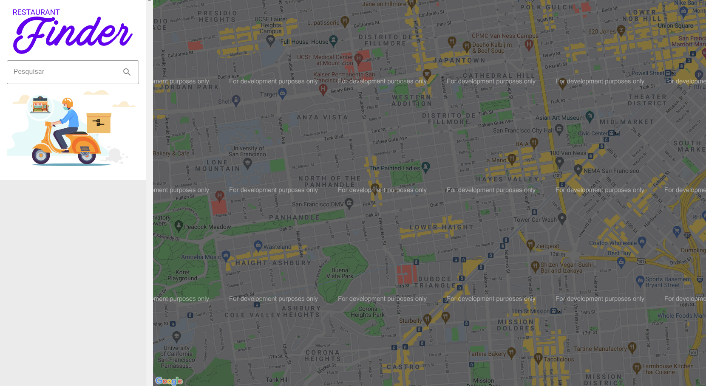

# Restaurant Finder


<p>Aplicação desenvolvida em React e com integração Google Maps.</p>

<p>Tecnologias utilizadas: HTML, CSS/SASS, JavaScript, React.Js. </p>
 
## Como usar? ##
 
  

  &#xa0;


</div>

<p align="center">
  <a href="#dart-sobre">Sobre</a> &#xa0; | &#xa0;   
  <a href="#rocket-tecnologias">Tecnologias</a> &#xa0; | &#xa0;
  <a href="#white_check_mark-pré-requesitos">Pré requisitos</a> &#xa0; | &#xa0;
  <a href="#checkered_flag-começando">Iniciando</a> &#xa0; | &#xa0;
  <a href="#memo-licença">Licença</a> &#xa0; | &#xa0;
</p>

<br>

## :dart: Sobre ##

Restaurant Finder é uma aplicação para localizar restaurantes próximos, com integração em Google Maps.

## :rocket: Tecnologias ##

As seguintes ferramentas foram usadas na construção do projeto:

- [React](https://pt-br.reactjs.org/)

## :white_check_mark: Pré requisitos ##

Antes de começar :checkered_flag:, você precisa ter o [Git](https://git-scm.com) e o [Node](https://nodejs.org/en/) instalados no PC!

## :checkered_flag: Iniciando ##

```bash
# Clone este repositório
$ git clone https://github.com/gabimesquita/Restaurant_Finder

# Entre na pasta
$ cd restaurant_finder

# Instale as dependências
$ yarn

# Para iniciar o projeto
$ yarn start

# O app vai inicializar em <http://localhost:3000>
```

## :memo: Licença ##

Este projeto está sob licença MIT. Veja o arquivo [LICENSE](license.md) para mais detalhes.


&#xa0;

<a href="#top">Voltar para o topo</a>
